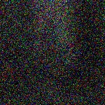

# Image Quality Assessment System

## 1. Project Overview

This project is an AI-based Image Quality Assessment system that evaluates the quality of an uploaded image.

The system analyzes different visual properties of an image, combines traditional image-quality features with a Convolutional Autoencoder reconstruction error, and uses a Random Forest classifier to classify the image into one of three quality categories:

- **ACCEPTABLE**
- **DEGRADED**
- **DEFECTIVE**

The application consists of:

- React + Vite frontend
- FastAPI backend
- Computer-vision based feature extraction
- PyTorch Convolutional Autoencoder
- Random Forest classifier
- SQLite database
- Docker and Docker Compose deployment

---

# 2. Project Structure

```text
IITH_prototype/
│
├── backend/
│   ├── main.py
│   ├── model.py
│   ├── features.py
│   ├── requirements.txt
│   └── Dockerfile
│
├── frontend/
│   ├── src/
│   │   ├── App.jsx
│   │   ├── main.jsx
│   │   └── index.css
│   ├── package.json
│   ├── package-lock.json
│   └── Dockerfile
│
├── data/
│   ├── seg_train/
│   ├── seg_test/
│   └── seg_pred/
│
├── models/
│   ├── autoencoder.pth
│   └── quality_classifier.pkl
│
├── docker-compose.yml
├── .dockerignore
├── .gitignore
└── README.md
```

The dataset is excluded from Git using `.gitignore`.

---

# 3. Technologies Used

## Frontend

- React
- Vite
- JavaScript
- HTML
- CSS

## Backend

- Python
- FastAPI
- Uvicorn
- OpenCV
- NumPy
- Pillow
- PyTorch
- Scikit-learn

## Database

- SQLite

## Deployment

- Docker
- Docker Compose

---

# 4. Setup Instructions

## 4.1 Prerequisites

The following software is required for running the project locally:

- Python 3.11 or later
- Node.js and npm
- Docker Desktop (for Docker deployment)
- Git

Make sure Docker Desktop is running before using Docker Compose.

---

## 4.2 Clone the Repository

Clone the GitHub repository:

```bash
git clone <YOUR_GITHUB_REPOSITORY_URL>
```

Move into the project directory:

```bash
cd IITH_prototype
```

---

# 5. Backend Setup

From the project root directory, install the Python dependencies:

```bash
pip install -r backend/requirements.txt
```

Start the FastAPI backend:

```bash
python -m uvicorn backend.main:app --reload
```

The backend will normally be available at:

```text
http://127.0.0.1:8000
```

Check the API:

```text
http://127.0.0.1:8000/
```

Health check:

```text
http://127.0.0.1:8000/health
```

A successful health check should return:

```json
{
  "status": "healthy",
  "models_ready": true
}
```

The `models_ready` value confirms that the trained models have been loaded successfully.

---

# 6. Frontend Setup

Open a new terminal.

Move into the frontend directory:

```bash
cd frontend
```

Install the frontend dependencies:

```bash
npm install
```

Start the Vite development server:

```bash
npm run dev
```

Vite will display the frontend URL.

Normally it will be:

```text
http://localhost:5173
```

Open the URL in a browser.

The frontend communicates with the FastAPI backend running on port 8000.

---

# 7. Dataset

The project uses the Intel Image Classification dataset.

The dataset contains the following scene categories:

```text
buildings
forest
glacier
mountain
sea
street
```

The dataset is organized as:

```text
data/
├── seg_train/
├── seg_test/
└── seg_pred/
```

These categories describe the scene content of the images and are not the final image-quality labels.

For image-quality assessment, controlled image degradations are applied to images to create quality-labeled examples.

---

# 8. Image Quality Features

The system extracts 11 traditional image-quality features:

```text
sharpness
exposure
brightness
underexposed_ratio
overexposed_ratio
noise
noise_level
contrast
contrast_value
saturation
mean_saturation
```

A 12th feature is obtained from the Convolutional Autoencoder:

```text
reconstruction_error
```

Therefore, the final Random Forest classifier uses **12 features**.

---

# 9. Model and Training

## 9.1 Convolutional Autoencoder

A Convolutional Autoencoder is used to reconstruct input images.

The encoder learns a compact representation of the image, while the decoder reconstructs the image from that representation.

The difference between the original image and the reconstructed image is measured using Mean Squared Error (MSE).

The reconstruction error is calculated as:

```text
MSE = Mean((Original Image - Reconstructed Image)^2)
```

This reconstruction error is used as the 12th feature for the final quality classifier.

The trained autoencoder is stored at:

```text
models/autoencoder.pth
```

### Training the Autoencoder

From the project root, run:

```bash
python -c "from backend.model import train_autoencoder; train_autoencoder()"
```

The training function uses:

```text
data/seg_train
```

The trained model is saved as:

```text
models/autoencoder.pth
```

---

## 9.2 Random Forest Quality Classifier

The extracted image-quality features and the autoencoder reconstruction error are combined into a 12-feature vector.

This vector is given to a Random Forest classifier.

The classifier predicts:

```text
ACCEPTABLE
DEGRADED
DEFECTIVE
```

The trained classifier is stored at:

```text
models/quality_classifier.pkl
```

### Training the Quality Classifier

From the project root, run:

```bash
python -c "from backend.model import train_quality_model; train_quality_model()"
```

The training process uses the training images and controlled image-quality degradations to generate the required quality classes.

---

# 10. Quality Degradation

Controlled degradations are used to generate different image-quality conditions.

The current degradation types include:

- Gaussian blur
- Darkening
- Brightening
- Gaussian noise
- Severe blur and noise

The quality labels are:

| Image condition | Quality label |
|---|---|
| Original image | ACCEPTABLE |
| Blur | DEGRADED |
| Dark | DEGRADED |
| Bright | DEGRADED |
| Noise | DEGRADED |
| Severe degradation | DEFECTIVE |

This provides a controlled and reproducible method for training and evaluating the quality classifier.

---

# 11. Model Inference

When an image is submitted to the application, the following process takes place:

```text
Uploaded Image
      |
      v
Image Preprocessing
      |
      v
Traditional Feature Extraction
      |
      +----------------------+
      |                      |
      v                      v
Image Quality Features   Autoencoder
                             |
                             v
                    Reconstruction Error
      |                      |
      +----------+-----------+
                 |
                 v
           12 Feature Vector
                 |
                 v
        Random Forest Classifier
                 |
                 v
        Quality Classification
                 |
                 v
      Quality Score + Issues
                 |
                 v
          SQLite Database
```

The trained models are loaded when the FastAPI backend starts.

The models used for inference are:

```text
models/autoencoder.pth
models/quality_classifier.pkl
```

---

# 12. Quality Score

The Random Forest model produces probabilities for the three quality classes.

These probabilities are converted into a quality score between 0 and 100.

The score is calculated using:

```text
Score =
P(ACCEPTABLE) × 100
+
P(DEGRADED) × 55
+
P(DEFECTIVE) × 10
```

The final score is rounded to two decimal places.

---

# 13. Detected Image-Quality Issues

The system can identify the following issues:

- Blur
- Underexposure
- Overexposure
- Noise
- Visual defect

For each detected issue, the API returns:

- Issue type
- Severity
- Confidence

Example:

```json
{
  "type": "noise",
  "severity": "medium",
  "confidence": 0.66
}
```

---

# 14. API Documentation

The backend is implemented using FastAPI.

The main API endpoints are:

| Method | Endpoint | Purpose |
|---|---|---|
| GET | `/` | Basic API status |
| GET | `/health` | Backend and model health check |
| POST | `/analyze` | Analyze an uploaded image |
| GET | `/history` | Retrieve previous analyses |

---

## 14.1 GET /

Returns a basic API status message.

Request:

```http
GET /
```

Example response:

```json
{
  "message": "Image Quality Assessment API"
}
```

---

## 14.2 GET /health

Checks whether the backend is running and whether the trained models are available.

Request:

```http
GET /health
```

Example response:

```json
{
  "status": "healthy",
  "models_ready": true
}
```

---

## 14.3 POST /analyze

Analyzes an uploaded image.

Request:

```http
POST /analyze
Content-Type: multipart/form-data
```

The image must be sent using the form field:

```text
file
```

### cURL Example

```bash
curl -X POST "http://localhost:8000/analyze" -F "file=@sample.jpg"
```

### Example Response

```json
{
  "quality_score": 97.61,
  "quality_label": "ACCEPTABLE",
  "issues": [
    {
      "type": "noise",
      "severity": "medium",
      "confidence": 0.66
    }
  ]
}
```

---

## 14.4 GET /history

Returns previous analyses stored in the SQLite database.

Request:

```http
GET /history
```

Example using cURL:

```bash
curl http://localhost:8000/history
```

---

# 15. Database Setup

The application uses **SQLite** for storing analysis history.

No separate database server is required.

When the FastAPI backend starts, it automatically creates the SQLite database and the required table if they do not already exist.

The `analyses` table stores:

```text
id
filename
quality_score
quality_label
issues
created_at
```

The `/history` API retrieves the stored analyses.

For Docker deployment, the database is stored using the configured Docker volume so that analysis history can persist.

---

# 16. Evaluation

The trained quality classifier was evaluated using **500 previously unseen test images** from:

```text
data/seg_test
```

Controlled image degradations were applied to create known quality conditions.

## Evaluation Results

| Metric | Result |
|---|---:|
| Accuracy | **95.57%** |
| Macro Precision | **94.85%** |
| Macro Recall | **93.83%** |
| Macro F1-score | **94.30%** |

## Confusion Matrix

```text
                 Predicted
              ACCEPTABLE  DEGRADED  DEFECTIVE

ACCEPTABLE         422        77         1
DEGRADED            45      1946         9
DEFECTIVE            0         1       499
```

The model correctly identified 499 out of 500 DEFECTIVE samples in the controlled evaluation.

## Technical Explanation

The system combines traditional image-quality measurements with a learned reconstruction error.

Traditional features provide direct information about properties such as sharpness, exposure, noise, contrast, and saturation.

The autoencoder provides an additional learned representation through reconstruction error.

These 12 features are then passed to the Random Forest classifier. Combining both types of information helps the classifier distinguish between acceptable images, degraded images, and severely degraded images.

## Evaluation Limitation

The evaluation uses synthetically generated image degradations rather than a large human-annotated real-world image-quality dataset.

This makes the evaluation controlled and reproducible, but real-world image defects can be more diverse.

Therefore, the reported results represent performance under the controlled degradation conditions used in this project.

---

# 17. Sample Images

Sample images for demonstrating different quality conditions can be selected from:

```text
data/seg_test/
```

The project can demonstrate conditions such as:

| Sample condition | Expected class |
|---|---|
| Clear/original image | ACCEPTABLE |
| Blurred image | DEGRADED |
| Dark image | DEGRADED |
| Bright image | DEGRADED |
| Noisy image | DEGRADED |
| Severely degraded image | DEFECTIVE |

For the final demonstration, one or more images representing each condition can be uploaded through the frontend.

The complete dataset is not included in the Git repository because the `data/` directory is excluded using `.gitignore`.

---

# 18. Docker Deployment

Docker Compose is used to run the complete application outside the original development environment.

The deployment consists of two services:

```text
Frontend
Backend
```

---

## 18.1 Prerequisites

Install:

- Docker Desktop
- Docker Compose

Start Docker Desktop and make sure the Docker Engine is running.

Verify Docker:

```bash
docker --version
```

Verify Docker Compose:

```bash
docker compose version
```

---

## 18.2 Clone the Project

Clone the repository:

```bash
git clone <YOUR_GITHUB_REPOSITORY_URL>
```

Move into the project directory:

```bash
cd IITH_prototype
```

---

## 18.3 Build the Docker Images

From the project root, run:

```bash
docker compose build
```

This builds:

- The React frontend Docker image
- The FastAPI backend Docker image

The backend image contains the required Python and machine-learning dependencies and the trained models.

The first build can take several minutes because PyTorch and other ML dependencies need to be installed.

---

## 18.4 Start the Application

Run:

```bash
docker compose up
```

Docker Compose starts both containers.

The frontend is available at:

```text
http://localhost:5173
```

The backend is available at:

```text
http://localhost:8000
```

---

## 18.5 Verify the Deployment

Open the following URL:

```text
http://localhost:8000/health
```

Expected response:

```json
{
  "status": "healthy",
  "models_ready": true
}
```

The `models_ready: true` value confirms that the trained models have been loaded successfully inside the backend container.

---

## 18.6 Test the Frontend

Open:

```text
http://localhost:5173
```

Then:

1. Select an image.
2. Check the image preview.
3. Click **Analyze Image**.
4. Wait for the analysis to complete.
5. View the quality score.
6. View the predicted quality class.
7. Check the detected issues.
8. Check the analysis history.

---

## 18.7 Stop the Deployment

To stop the containers:

```bash
docker compose down
```

To start the already-built application again:

```bash
docker compose up
```

The Docker image does not need to be rebuilt every time unless the Docker configuration, dependencies, or files included in the image have changed.

---

# 19. Docker Deployment Architecture

```text
                         Browser
                            |
                            v
                  React Frontend
                  Docker Container
                  localhost:5173
                            |
                            | HTTP API
                            v
                  FastAPI Backend
                  Docker Container
                  localhost:8000
                            |
             +--------------+--------------+
             |              |              |
             v              v              v
       Feature          Autoencoder    Random Forest
       Extraction
                            |
                            v
                       SQLite Database
```

The frontend communicates with the backend using HTTP API requests.

The backend performs feature extraction and ML inference and returns the result to the frontend.

---

# 20. Model Loading in Docker

The trained models are copied into the backend Docker image:

```text
models/autoencoder.pth
models/quality_classifier.pkl
```

When the FastAPI container starts, the backend loads both models.

The autoencoder is used to calculate reconstruction error.

The Random Forest model uses the 12 extracted features to predict the final quality class.

The health endpoint verifies whether the models were loaded successfully.

---

# 21. Environment Configuration

The frontend backend URL can be configured using:

```text
VITE_API_URL
```

For local Docker deployment:

```text
VITE_API_URL=http://localhost:8000
```

This allows the backend URL to be changed for another deployment environment without changing the application logic.

---

# 22. Deployment Status

The application has been successfully tested using Docker Compose.

### Local Deployment

Frontend:

```text
http://localhost:5173
```

Backend:

```text
http://localhost:8000
```

Health check:

```text
http://localhost:8000/health
```

The `/health` endpoint returns:

```json
{
  "status": "healthy",
  "models_ready": true
}
```

The image-analysis functionality has also been tested through the Docker deployment.

### Public URL

A public cloud deployment is not used for the current version.

The project uses the permitted **local Docker Compose deployment**, so there is no public URL to provide.

---

# 23. Reproducibility

Backend dependencies are listed in:

```text
backend/requirements.txt
```

Frontend dependencies are listed in:

```text
frontend/package.json
```

The trained models are stored in:

```text
models/
```

Docker Compose provides a consistent environment for running the application outside the original development environment.

---

# 24. Limitations

- The quality labels are generated using controlled image degradations.
- Real-world image-quality problems can be more varied.
- The evaluation represents the tested controlled degradation conditions.
- The quality score is specific to this application and is not a universal image-quality standard.
- The current deployment is intended for local Docker execution.

---

# 25. Future Improvements

Possible improvements include:

- Using a larger real-world image-quality dataset
- Adding human-annotated image-quality labels
- Adding more types of visual defects
- Testing on naturally degraded images
- Improving quality-score calibration
- Adding more detailed explanations for predictions
- Improving the frontend interface
- Deploying the application to a cloud platform

---
## Sample Images

The following sample images demonstrate different image-quality conditions used by the system.

| Sample | Condition | Expected Quality |
|---|---|---|
| acceptable.jpg | Clear/original image | ACCEPTABLE |
| blurred.jpg | Blurred image | DEGRADED |
| dark.jpg | Underexposed image | DEGRADED |
| noisy.jpg | Noisy image | DEGRADED |
| defective.jpg | Severe degradation | DEFECTIVE |

### Samples

#### ACCEPTABLE


#### DEGRADED - Blur


#### DEGRADED - Dark


#### DEGRADED - Noise


#### DEFECTIVE

# 26. Conclusion

This project combines traditional computer vision, deep learning, and machine learning to create an end-to-end Image Quality Assessment system.

The application can:

- Accept an uploaded image
- Extract image-quality features
- Calculate autoencoder reconstruction error
- Predict image quality using a Random Forest classifier
- Generate a quality score
- Identify possible image-quality issues
- Store analysis history
- Provide REST APIs
- Run using Docker Compose

The controlled unseen-image evaluation achieved:

```text
Accuracy        : 95.57%
Macro Precision : 94.85%
Macro Recall    : 93.83%
Macro F1        : 94.30%
```

The complete application can be run locally or through Docker Compose.